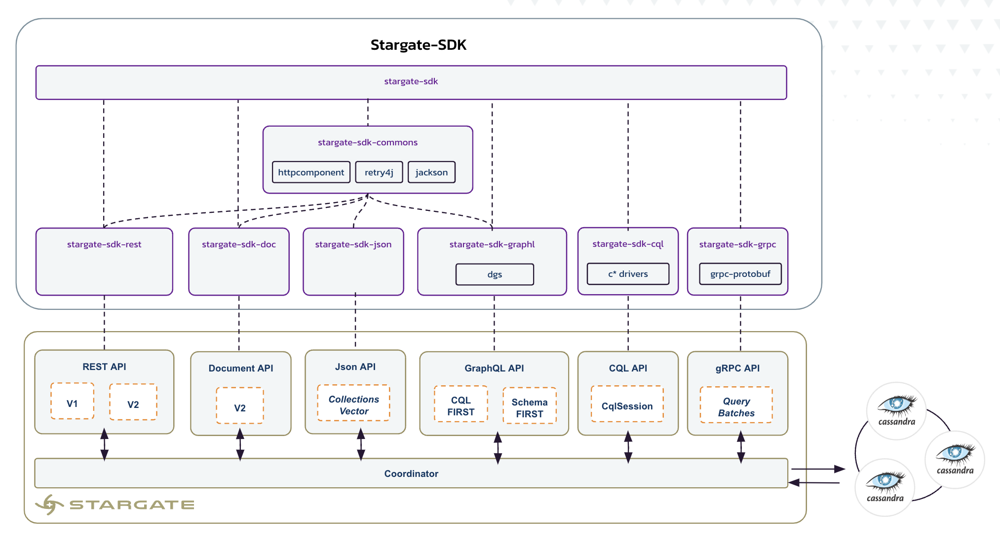

# Stargate Software Development Kit

[](http://www.apache.org/licenses/LICENSE-2.0)

This SDK *(Software Development Kit)* makes it easy to call Stargate services using idiomatic Java APIs.

## Table of Contents

[**1. Introducing Stargate**](#1-introducing-stargate)
- [1.1 - Overview](#11-overview)
- [1.2 - APIs descriptions](#12-api-descriptions)

[**2. Stargate SDK**](#2-stargate-sdk)
- [2.1 - Prerequisites](#21-prerequisites)
- [2.2 - Start Stargate](#22-start-stargate)
- [2.3 - QuickStart](#23-quickstart)
- [2.4 - Working with Rest API](#24-working-with-rest-api)
- [2.5 - Working with Document API](#25-working-with-document-api)
- [2.6 - Working with GRPC API](#26-working-with-grpc-api)
- [2.7 - Working with Graph API](#27-working-with-graph-ql)
- [2.8 - Working with Json API](#28-working-with-json-api)

## 1. Introducing Stargate

### 1.1 Overview

[Stargate](stargate.io) is a data API gateway that deploys between your apps and your Apache Cassandra database(s). Stargate is a framework used to customize all aspects of data access. It is deployed between client applications and a database to provide an abstraction layer that can be used to shape your data access to fit your application’s needs.

Stargate exposes multiple APis to access data stored in Cassandra, including REST, GraphQL, and schemaless Document APIs. This SDK provides a Java API to access to all of them.



### 1.2 Api Descriptions

| API                                                                               | Description                                                                                                                                                                                                                                                                                                                                                                                                                                                                                                                                                                                                                                                                                                                                                                                                                                                                                                                                                                                                                                                                                                                                                                                                                                                                                                                                                                                                                                                                                                                                      |
|-----------------------------------------------------------------------------------|--------------------------------------------------------------------------------------------------------------------------------------------------------------------------------------------------------------------------------------------------------------------------------------------------------------------------------------------------------------------------------------------------------------------------------------------------------------------------------------------------------------------------------------------------------------------------------------------------------------------------------------------------------------------------------------------------------------------------------------------------------------------------------------------------------------------------------------------------------------------------------------------------------------------------------------------------------------------------------------------------------------------------------------------------------------------------------------------------------------------------------------------------------------------------------------------------------------------------------------------------------------------------------------------------------------------------------------------------------------------------------------------------------------------------------------------------------------------------------------------------------------------------------------------------|
| [CQL](https://stargate.io/docs/latest/develop/dev-with-cql.html)                  | Stargate functions as a Cassandra node, allowing existing Cassandra drivers to be utilized for connections. The primary goal is to minimize the number of open connections by enabling clients to connect only to Stargate, rather than directly to the Cassandra data nodes. <p>This approach also serves as an effective method to separate computing and storage components.                                                                                                                                                                                                                                                                                                                                                                                                                                                                                                                                                                                                                                                                                                                                                                                                                                                                                                                                                                                                                                                                                                                                                                  |
| [JSON API](https://github.com/stargate/jsonapi/blob/main/docs/jsonapi-spec.md)   | Mongoose compatible Http API exposing operation to use Cassandra as a document database. It should be consider and an upgrade to the previously discussed document API. It also introduces support for vectors and semantic searches.
| [REST](https://stargate.io/docs/latest/develop/dev-with-rest.html)                | Stargate is a data gateway deployed between client applications and a database. The REST API exposes CRUD access to data stored in Cassandra tables.                                                                                                                                                                                                                                                                                                                                                                                                                                                                                                                                                                                                                                                                                                                                                                                                                                                                                                                                                                                                                                                                                                                                                                                                                                                                                                                                                                                             |
| [Document](https://stargate.io/docs/latest/develop/dev-with-doc.html) | Stargate serves as a data gateway positioned between client applications and a database. It features the Stargate Document API, which enables the modification and querying of data stored in the form of unstructured JSON documents within collections. A key advantage of the Document API is its schema-less nature, eliminating the need for data modeling. When integrated with Apache Cassandra, the Document API leverages Cassandra's secondary indexes for document indexing. Conversely, when used in conjunction with DataStax Enterprise, it utilizes SAI indexing for this purpose. Further insights into the architecture and storage methodologies of collections can be found in the blog post 'The Stargate Cassandra Documents API.                                                                                                                                                                                                                                                                                                                                                                                                                                                                                                                                                                                                                                                                                                                                                                                           |
| [GraphQL](https://stargate.io/docs/latest/develop/graphql.html)    | API implementation for exposing Cassandra data over GraphQL. The Stargate GraphQL API is implemented to easily modify and query your table data using GraphQL types, mutations, and queries with any Cassandra deployment. <p>The Stargate GraphQL API has two modes, one developed from native GraphQL schema principles, and one developed with the Cassandra Query Language (CQL) in mind. To distinguish these two modes, the rest of the documentation will refer to the modes as schema-first and cql-first. <li>The CQL-first approach directly translates CQL tables into GraphQL types, mutations, and queries. The GraphQL schema is automatically generated from the keyspace, tables, and columns defined, but no customization is allowed. A standard set of mutations and queries are produced for searching and modifying the table data. If you are familiar with Cassandra, you might prefer this approach.<li>The schema-first approach allows you to create idiomatic GraphQL types, mutations, and queries in a manner familiar to GraphQL developers. The schema is deployed and can be updated by deploying a new schema without recreating the tables and columns directly. Under the covers, this approach will create and modify the CQL tables to match the GraphQL types. The schema can be modified for CQL decorated schema, such as specifying table and column names in Cassandra, while retaining GraphQL-centric names for the types that correspond. If you are a GraphQL developer, this approach is for you.
| [GRPC](https://stargate.io/docs/latest/develop/dev-with-grpc.html)       | Stargate is a data gateway deployed between client applications and a database. gRPC is a modern, open source remote procedure call (RPC) framework. It enables client and server applications to communicate transparently, and makes it easier to build connected systems. The Stargate gRPC API is implemented to create language-specific queries using CQL with any Cassandra deployment.

## 2. Stargate SDK

### 2.1 Prerequisites

#### 📦 Docker
- Use the [reference documentation](https://www.docker.com/products/docker-desktop) to install **Docker Desktop**
- Validate your installation with

```bash
docker -v
docker run hello-world
```

#### 📦 Java Development Kit (JDK) 8+
- Use the [reference documentation](https://docs.oracle.com/javase/8/docs/technotes/guides/install/install_overview.html) to install a **Java Development Kit**
- Validate your installation with

```bash
java --version
```

#### 📦 Apache Maven
- Use the [reference documentation](https://maven.apache.org/install.html) to install **Apache Maven**
- Validate your installation with

```bash
mvn -version
```

> [🏠 Back to Table of Contents](#clipboard-table-of-content)

### 2.2 Start Stargate

- ✅ Use the script `start.sh` at root of the repository or start stargate with the following docker-compose command:

```bash
docker-compose -f ./stargate-sdk-test/src/test/resources/docker-compose.yml up -d
```

> Expected output
> ```console
> [+] Building 0.0s (0/0)                                                                                                    docker:desktop-linux
> [+] Running 6/6
>  ✔ Network resources_stargate         Created                                                                                              0.0s 
>  ✔ Container resources-coordinator-1  Healthy                                                                                              0.0s 
>  ✔ Container resources-jsonapi-1      Started                                                                                              0.0s 
>  ✔ Container resources-restapi-1      Started                                                                                              0.0s 
>  ✔ Container resources-graphqlapi-1   Started                                                                                              0.0s 
>  ✔ Container resources-docsapi-1      Started                                                                                              0.0s 
> ```

With development mode enabled, Stargate also plays the role of a data node, as such you do not need any extra Cassandra container.

Multiple ports have been declared are here what they are used for. The tools listed here (playground, swagger-ui( will be available about 40s after the docker run commmand.
- `8080` is the **Graphql** port you can access the playground on [http://localhost:8080/playground](http://localhost:8080/playground)
- `8081` is the Authentication port to retrieve a your token based on user/password
- `8082` is the Rest API port. You can access Swagger documentation on [http://localhost:8082/swagger-ui/#/](http://localhost:8082/swagger-ui/#/) also the health check is done through [http://localhost:8082/health](http://localhost:8082/health)
- `8181` is the Json Api port. You can access Swagger documentation on [http://localhost:8181/swagger-ui/#/](http://localhost:8181/swagger-ui/#/) also the health check is done through [http://localhost:8181/health](http://localhost:8181/health)
- `8090` is the Grpc port. A socket is open listening from Grpc calls.
- `9042` is the default CQL port. A socker is open listening CQL calls coming from the native drivers.

### 2.3. Quickstart

- ✅ Create the project `sdk-quickstart-stargate` with a maven archetype:

```bash
mvn archetype:generate \
  -DarchetypeGroupId=org.apache.maven.archetypes \
  -DarchetypeArtifactId=maven-archetype-quickstart \
  -DarchetypeVersion=1.4 \
  -DgroupId=com.datastax.tutorial \
  -DartifactId=sdk-quickstart-stargate \
  -Dversion=1.0.0-SNAPSHOT \
  -DinteractiveMode=false
```

- ✅ Import the project favorite IDE, and replace the `pom.xml` with the following XML.

```xml
<?xml version="1.0" encoding="UTF-8"?>
<project xmlns="http://maven.apache.org/POM/4.0.0" 
  xmlns:xsi="http://www.w3.org/2001/XMLSchema-instance"
  xsi:schemaLocation="http://maven.apache.org/POM/4.0.0 http://maven.apache.org/xsd/maven-4.0.0.xsd">
  <modelVersion>4.0.0</modelVersion>
  <groupId>com.datastax.tutorial</groupId>
  <artifactId>sdk-quickstart-stargate</artifactId>
  <version>1.0.0-SNAPSHOT</version>
  <name>sdk-quickstart-stargate</name>
  <properties>
    <project.build.sourceEncoding>UTF-8</project.build.sourceEncoding>
    <maven.compiler.source>1.8</maven.compiler.source>
    <maven.compiler.target>1.8</maven.compiler.target>
  </properties>
  <dependencies>
    <dependency>
	  <groupId>com.datastax.stargate</groupId>
	  <artifactId>stargate-sdk</artifactId>
	  <version>0.2.5</version>
    </dependency>
  </dependencies>
</project>
```

- ✅ Delete folder `src/test/java`, we will experiment with a main class.

ℹ️ **Informations:**

- We removed the Junit classes generated as we will work a main class.
- We added the latest version [](https://maven-badges.herokuapp.com/maven-central/com.datastax.stargate/stargate-sdk/) of `stargate-sdk` dependency. The xml below may no be up-to-date.

#### ✅ Initialize Stargate client

`StargateClient` is the class you will have to work with, from there you leverage on a fluent api.

Rename `App.java` to `QuickstartStargate.java` and update the class accordingly.

```java
public static void main(String[] args) {
  try (StargateClient stargateClient = configureStargateClient()) {
    // work with Stargate
  }
}
public static StargateClient configureStargateClient() {
  return StargateClient.builder()
    .withCqlContactPoints("localhost:9042")
    .withLocalDatacenter("datacenter1")
    .withAuthCredentials("cassandra", "cassandra")
    .withApiNode(new StargateNodeConfig("127.0.0.1"))
    .build();
}
```

ℹ️ **Informations**

* Based on parameters provided in the builder, the 5 apis *(cql,rest,doc,graphQL,grpc)* will be enabled of not.

* As `CqlSession` is stateful you need to close it at the application shutdown. `StargateClient` is no different, if you enable Cql api, you need to close it at the application shutdown. To cope with this constraint the class is `Autocloseable`.

* **Cql:** needs `contact-points`, `localdatacenter` and `credentials`. If not provided the default values for contact points is `localhost:9042`

* **Https Api** need the `hostname`, `port numbers` and `credentials`. But if you are using the default ports no need to specified them.

#### ✅ Execute the main class `QuickstartStargate.java`

To run the application you can either use your IDE or maven

```
mvn exec:java -Dexec.main=com.datastax.tutorial.QuickstartStargate
```

**👁️ Expected output**
```bash
INFO com.datastax.stargate.sdk.StargateClient       : Initializing [StargateClient]
INFO com.datastax.stargate.sdk.StargateClient       : + Stargate nodes #[1] in [datacenter1]
INFO com.datastax.stargate.sdk.StargateClient       : + CqlSession   :[ENABLED]
INFO com.datastax.stargate.sdk.rest.ApiDataClient   : + API Data     :[ENABLED]
INFO com.datastax.stargate.sdk.doc.ApiDocumentClient: + API Document :[ENABLED]
INFO com.datastax.stargate.sdk.gql.ApiGraphQLClient : + API GraphQL  :[ENABLED]
INFO com.datastax.stargate.sdk.grpc.ApiGrpcClient . : + API Grpc     :[ENABLED]
INFO com.datastax.stargate.sdk.StargateClient       : Closing CqlSession.
```

#### ✅ Check you can invoke each Api. Add the following utilities methods in `QuickstartStargate.java`

```java
public static void testCqlApi(StargateClient stargateClient) {
  CqlSession cqlSession = stargateClient.cqlSession().get();
  System.out.println("Cql Version (cql)   : " + cqlSession
    .execute("SELECT cql_version from system.local")
    .one().getString("cql_version"));
}
    
public static void testRestApi(StargateClient stargateClient) {
  System.out.println("Keyspaces (rest)    : " + 
    stargateClient.apiRest()
                  .keyspaceNames()
                  .collect(Collectors.toList()));
}
    
public static void testDocumentaApi(StargateClient stargateClient) {
  System.out.println("Namespaces (doc)    : " + 
    stargateClient.apiDocument()
                  .namespaceNames()
                  .collect(Collectors.toList()));
}
    
public static void testGraphQLApi(StargateClient stargateClient) {
  System.out.println("Keyspaces (graphQL) : " + 
    stargateClient.apiGraphQL().cqlSchema().keyspaces());
}
    
public static void testGrpcApi(StargateClient stargateClient) {
  System.out.println("Cql Version (grpc)  : " + 
    stargateClient.apiGrpc()
                  .execute("SELECT cql_version from system.local")
                  .one().getString("cql_version"));
}
```

#### ✅ Update the `main` method accordingly:

```java
public static void main(String[] args) {
   try (StargateClient stargateClient = configureStargateClientDefault()) {
      testCqlApi(stargateClient);
      testRestApi(stargateClient);
      testDocumentaApi(stargateClient);
      testGraphQLApi(stargateClient);
      testGrpcApi(stargateClient);
   }
}
```

#### ✅ Execute the main class `QuickstartStargate.java` again

**👁️ Expected output**
```bash
INFO com.datastax.stargate.sdk.StargateClient       : Initializing [StargateClient]
INFO com.datastax.stargate.sdk.StargateClient       : + Stargate nodes #[1] in [datacenter1]
INFO com.datastax.stargate.sdk.StargateClient       : + CqlSession   :[ENABLED]
INFO com.datastax.stargate.sdk.rest.ApiDataClient   : + API Data     :[ENABLED]
INFO com.datastax.stargate.sdk.doc.ApiDocumentClient: + API Document :[ENABLED]
INFO com.datastax.stargate.sdk.gql.ApiGraphQLClient : + API GraphQL  :[ENABLED]
INFO com.datastax.stargate.sdk.grpc.ApiGrpcClient . : + API Grpc     :[ENABLED]
Cql Version (cql)   : 3.4.4
Keyspaces (rest)    : [system_distributed, system, data_endpoint_auth, system_schema, java, stargate_system, system_auth, system_traces]
Namespaces (doc)    : [system_distributed, system, data_endpoint_auth, system_schema, java, stargate_system, system_auth, system_traces]
Keyspaces (graphQL) : {"data":{"keyspaces":[{"name":"system_distributed"},{"name":"system"},{"name":"data_endpoint_auth"},{"name":"system_schema"},{"name":"java"},{"name":"stargate_system"},{"name":"system_auth"},{"name":"system_traces"}]}}
Cql Version (grpc)  : 3.4.4
INFO com.datastax.stargate.sdk.StargateClient       : Closing CqlSession.
```

> ℹ️ **Reminder:** You can download the code here 📥 [Download](https://github.com/DataStax-Examples/astra-samples-java-sdk/tree/main/sdk-failover-stargate)

**Congratulations:** you are ready to explore each Api leveraging the fluent api.
                                                                                                              |
### 2.4. Working with Rest API

> Related Api Reference documentation and endpoints can be found [there](https://docs.datastax.com/en/astra/docs/_attachments/restv2.html)

#### `ApiDataClient` Initialization

Class [`ApiDataClient`](https://github.com/datastax/astra-sdk-java/blob/main/stargate-sdk/src/main/java/com/datastax/stargate/sdk/rest/ApiDataClient.java) is the core class to work with Rest DATA. There are multiple ways to retrieve or initialize it.

```java
// Option1. Given an astraClient
ApiDataClient client1 = astraClient.apiStargateData();
ApiDataClient client2 = astraClient.getStargateClient().apiRest();

// Option 2. Given a StargateClient
ApiDataClient client3 = stargateClient.apiRest();

// Option 3. Constructors
ApiDataClient client4_Astra    = new ApiDataClient("http://api_endpoint", "apiToken");
ApiDataClient client5_Stargate = new ApiDataClient("http://api_endpoint", 
  new TokenProviderDefault("username", "password", "http://auth_endpoint");
```

From now, in another samples, we will use the variable name `apiClient` as our working instance of `ApiDataClient`

#### Working with keyspaces

> [DataApiIntegrationTest](https://github.com/datastax/astra-sdk-java/blob/main/astra-sdk/src/test/java/com/datastax/astra/sdk/stargate/DataApiIntegrationTest.java) is the main unit test for this API and could be use as reference code

- ✅. Lists available Keyspace Names

```java
Stream<String> keyspaceNames = apiClient.keyspaceNames();
```
- ✅. Lists available Keyspaces

```java
Stream<Keyspace> keyspaces = apiClient.keyspaces();
```
- 
- ✅. Find a keyspace by its id

```java
Optional<Keyspace> ns1 = apiClient.keyspace("ks1").find();
```

- ✅. Test if a keyspace exists

```java
apiClient.keyspace("ks1").exist();
```

- ✅. Create a new keyspace

> 🚨 *As of Today, namespaces and keyspaces creations in ASTRA are available only at the DevOps API level but work in in a StandAlone stargate deployment*

```java
// Create a keyspace with a single DC dc-1
DataCenter dc1 = new DataCenter("dc-1", 1);
apiClient.keyspace("ns1").create(dc1);

// Create a keyspace providing only the replication factor
apiClient.keyspace("ns1").createSimple(3);
```

- ✅. Delete a keyspace

> 🚨 *As of today namespaces and keyspaces creations are not available in ASTRA but work as expected with standalone stargate.*

```java
apiClient.keyspace("ns1").delete();
```

**ℹ️ Tips**

You can simplify the code by assigning `apiClient.keyspace("ks1")` to a `KeyspaceClient` variable as shown below:

```java
KeyspaceClient ks1Client = astraClient.apiStargateData().keyspace("ns1");
        
// Create if not exist
if (!ks1Client.exist()) {
  ks1Client.createSimple(3);
}
        
// Show datacenters where it lives
ks1Client.find().get().getDatacenters()
         .stream().map(DataCenter::getName)
         .forEach(System.out::println); 
        
// Delete 
ks1Client.delete();
```

#### Working with Tables

- ✅. Lists available tables in a keyspace

```java

// We can create a local variable to shorten the code.
KeyspaceClient ks1Client = apiClient.keyspace("ks1");

// List names of the tables
Stream<String> tableNames = ks1Client.tableNames();

// List Definitions of the table (primarykey...)
Stream<TableDefinition> tableDefinitions = ks1Client.tables();
```

- ✅. Check if a table exists

```java
TableClient tableXClient = apiClient.keyspace("ks1").table("table_x");
boolean colExist = tableXClient.exist();
```

- ✅. Retrieve a table definition from its name

```java
Optional<TableDefinition> = apiClient.keyspace("ks1").table("table_x").find();
```

-  ✅. Create a table

A TableDefinition is expected to create a table. It will detailed all columns and their specific natures (partition key and clustering columns). It can be pretty verbose as such a Builder is provided [`TableCreateBuilder`](https://github.com/datastax/astra-sdk-java/blob/main/stargate-sdk/src/main/java/com/datastax/stargate/sdk/rest/domain/CreateTable.java#L71).

```java
// Using a builder to define the table structure
apiClient.keyspace("ks1").table("table_x").create(
  CreateTable.builder()
    .ifNotExist(true)
    .addPartitionKey("genre", "text")
    .addClusteringKey("year", "int", Ordering.DESC)
    .addClusteringKey("title", "text", Ordering.ASC)
    .addColumn("upload", "timestamp")
    .addColumn("tags", "set<text>")
    .addColumn("frames", "list<int>")
    .addColumn("tuples", "tuple<text,text,text>")
    .addColumn("formats", "frozen<map <text,text>>")
    .build()
);
```

- ✅. Update Table options

```java
// You can change the TTL and some clustering columns informations
apiClient.keyspace("ks1").table("table_x")
         .updateOptions(new TableOptions(25, null));
```

-  ✅. Delete a table

```java
apiClient.keyspace("ks1").table("table_x").delete();
```

#### Working with Columns

- ✅. Lists available columns in a Table

```java
// Get column Names
Stream<String> columnNames = apiClient.keyspace("ks1").table("table_x").columnNames();

// Get Column Definition
Stream<ColumnDefinition> columns = apiClient.keyspace("ks1").table("table_x").columns();
```

- ✅. Check if columns exists

```java
boolean colExist = apiClient.keyspace("ks1").table("table_x").column("col1").exist();
```

- ✅. Retrieve a columns from its name

```java
Optional<ColumnDefinition> col = apiClient
   .keyspace("ks1")
   .table("table_x")
   .column("col1")
   .find();
```

- ✅. Create an new Column

```java
apiClient.keyspace("ks1")
         .table("table_x")
         .column("col1")
         .create(new ColumnDefinition("col", "text"));
```

- ✅. Rename a column

```java
apiClient.keyspace("ks1")
         .table("table_x")
         .column("col1")
         .rename("col2");
```

-  ✅. Delete a column

```java
apiClient.keyspace("ks1")
         .table("table_x")
         .column("col1").delete();
```

#### Working with Indexes

- ✅. Lists available indexes in a Table

```java
// Get column Names
Stream<String> indexesNames = apiClient.keyspace("ks1").table("table_x").indexesNames();

// Get Column Definition
Stream<IndexDefinition> indexes = apiClient.keyspace("ks1").table("table_x").indexes();
```

- ✅. Check if index exists

```java
boolean colExist = apiClient.keyspace("ks1").table("table_x").index("idx1").exist();
```

- ✅. Retrieve a index from its name

```java
Optional<IndexDefinition> idxDef = apiClient
   .keyspace("ks1")
   .table("table_x")
   .index("idx1")
   .find();
```

- ✅. Create an new Index

```java
CreateIndex cIdx = CreateIndex.builder()
  .ifNotExist(true)
  .name("idx1").column("title")
  .sasi()
  .build();
apiClient.keyspace("ks1")
         .table("table_x")
         .index("idx1")
         .create(cIdx);
```

- ✅. Delete an Index

```java
apiClient.keyspace("ks1")
         .table("table_x")
         .index("idx1")
         .delete();
```

#### Working with User Defined Types

- ✅. Lists available types in a keyspace

```java

// We can create a local variable to shorten the code.
KeyspaceClient ks1Client = apiClient.keyspace("ks1");

// List names of the types
Stream<String> typeNames = ks1Client.typeNames();

// List Definitions of the type (attributes...)
Stream<TypeDefinition> typeDefinitions = ks1Client.types();
```

- ✅. Check if a type exists

```java
TypeClient typeVideo = apiClient.keyspace("ks1").type("videos");
boolean colExist = typeVideo.exist();
```

- ✅. Retrieve a type definition from its name

```java
Optional<TypeDefinition> = apiClient.keyspace("ks1").type("videos").find();
```

- ✅. Create a type

```java
// Using a builder to define the table structure
CreateType ct = new CreateType("videos", true);
ct.getFields().add(new TypeFieldDefinition("city", "text"));
ct.getFields().add(new TypeFieldDefinition("zipcode", "int"));
ct.getFields().add(new TypeFieldDefinition("street", "text"));
ct.getFields().add(new TypeFieldDefinition("phone", "list<text>"));
apiClient.keyspace("ks1").type("videos").create(ct);
```

- ✅. Update a type

```java
UpdateType ut= new UpdateType();
// Fields to add
ut.getAddFields().add(new TypeFieldDefinition("country","text" ));
// Fields to rename
ut.getRenameFields().add(new TypeFieldUpdate("city", "town"));
address.update(ut);
```

- ✅. Delete a type

```java
apiClient.keyspace("ks1").type("videos").delete();
```

## 2.5. Working with Document API

Stargate and Astra bring great innovation by allowing Apache Cassandra™ to store JSON documents like a document-oriented noSQL database. The same data model is in use for each document collection leveraging a [document shredding](https://stargate.io/2020/10/19/the-stargate-cassandra-documents-api.html) stratefy.

#### ApiDocumentClient Initialization

> Main client object initializations (`AstraClient` and `StargateClient`) have been detailed on the [Home](https://github.com/datastax/astra-sdk-java/wiki) page. Moving forward the sample code will reuse those classes but do not initialize them.

[`ApiDocumentClient`](https://github.com/datastax/astra-sdk-java/blob/main/stargate-sdk/src/main/java/com/datastax/stargate/sdk/doc/ApiDocumentClient.java) is the core class when it comes to work with documents.

```java
// Option1. Retrieved from astraClient
ApiDocumentClient apiDocClient1 = astraClient.apiStargateDocument();
ApiDocumentClient apiDocClient2 = astraClient.getStargateClient().apiDocument()

// Option 2. Retrieved from StargateClient
ApiDocumentClient astraClient3 = stargateClient.apiDocument();

// Option 3. Built from the endpoint and credentials
ApiDocumentClient astraClient4    = new ApiDocumentClient("http://api_endpoint", "apiToken");
ApiDocumentClient astraClient5 = new ApiDocumentClient("http://api_endpoint", 
  new TokenProviderDefault("username", "password", "http://auth_endpoint");
```

For the rest of the document `apiDocClient`  will refer to `ApiDocumentClient` but the initialization code will not be duplicated.

#### Working with Namespaces

Namespace if the term used to talk about keyspaces when dealing with the document API.

> [DocumentApiIntegrationTest](https://github.com/datastax/astra-sdk-java/blob/main/astra-sdk/src/test/java/com/datastax/astra/sdk/stargate/DocumentApiIntegrationTest.java) is the unit test class for this API where you can find more sample usage of the SDK.

- ✅.   List `Namespaces` Names

```java
Stream<String> namespaces = apiDocClient.namespaceNames();
```

- ✅. List `Namespaces` objects

>[Reference Api documentation](https://docs.datastax.com/en/astra/docs/_attachments/docv2.html#operation/getAllNamespaces)

```java
Stream<Namespace> namespaces = apiDocClient.namespaces();
```

The Namespace class provides the replication factor and or the datacenter list for a namespace.

```java
public class Namespace {
    protected String name;
    protected Integer replicas;
    protected List<DataCenter> datacenters;
}
```

- ✅. Find `Namespace` by its name

>[Reference Api documentation](https://docs.datastax.com/en/astra/docs/_attachments/docv2.html#operation/getNamespace)

The parameter *ns1* is here the unique identifier for the namespace

```java
Optional<Namespace> ns1 = apiDocClient.namespace("ns1").find();
```

- ✅. Test if  `Namespace` exists

The parameter *ns1* is here the unique identifier for the namespace

```java
apiDocClient.namespace("ns1").exist();
```

- ✅. Create `Namespace`

> 🚨 *As of Today, in Astra, Namespaces and Keyspaces creations are only available at the DevOps API level or through the user interface.*

```java
// Create a namespace with a single DC dc-1
DataCenter dc1 = new DataCenter("dc-1", 1);
apiDocClient.namespace("ns1").create(dc1);

// Create a namespace providing only the replication factor
apiDocClient.namespace("ns1").createSimple(3);
```

-  ✅. Delete a namespace

> 🚨 *As of Today, in Astra, Namespaces and Keyspaces deletions are only available at the DevOps API level or through the user interface.*

The parameter *ns1* is here the unique identifier for the namespace.

```java
apiDocClient.namespace("ns1").delete();
```

**ℹ️ Fluent API**

You can assign `apiDocClient.namespace("ns1")` to a `NamespaceClient` variable as shown below to simplify your code.

```java
NamespaceClient ns1Client = astraClient.apiStargateDocument().namespace("ns1");
        
// Create if not exist
if (!ns1Client.exist())  ns1Client.createSimple(3);
        
// Show datacenters 
ns1Client.find().get()
    .getDatacenters()
    .stream()
    .map(DataCenter::getName)
    .forEach(System.out::println); 
        
// Delete 
ns1Client.delete();
```

#### Working with Collections

>[Reference Api documentation](https://docs.datastax.com/en/astra/docs/_attachments/docv2.html#tag/Documents)

Thanks to fluent API code is simplified by assigning `ns1Client` as `NamespaceClient` for `ns1`.

```java
NamespaceClient ns1Client = astraClient.apiStargateDocument().namespace("ns1");
```

-  ✅. List `Collections` in namespace

```java
Stream<String> colNames   = ns1Client.collectionNames();
```

- ✅. Test if `Collection` exists

The parameter *col1* is here the unique identifier for the collection in the current namespace.

```java
boolean colExist =  = ns1Client.collection("col1").exist();
```

- ✅. Retrieve a `Collection` from its name

The parameter *col1* is here the unique identifier for the collection in the current namespace.

```java
Optional<CollectionDefinition> = ns1Client.collection("col1").find();
```

-  ✅. Create an empty `Collection`

The parameter *col1* is here the unique identifier for the collection in the current namespace.

```java
ns1Client.collection("col1").create();
```

-  ✅. Delete a collection

The parameter *col1* is here the unique identifier for the collection in the current namespace.

```java
ns1Client.collection("col1").delete();
```

**ℹ️ Fluent API**

Code can be simplified by assigning `col1Client` as `CollectionClient` for collection `col1` in namespace `ns1`.

```java
CollectionClient col1Client = astraClient.apiStargateDocument().namespace("ns1").collection("col1");
```

#### Working with Documents

- 📘. About `Document`

With Stargate document API, documents are retrieved with a Json payload and an unique identifier (UUID).

```json
{
  "data": {
    "9e14db1c-0a05-47d2-9f27-df881f7f37ab": { "p1": "v1", "p2": "v2"},
    "9e14db1c-0a05-47d2-9f27-df881f7f37ac": { "p1": "v11", "p2": "v21"},
    "9e14db1c-0a05-47d2-9f27-df881f7f37ad": { "p1": "v12", "p2": "v22"}
  }
}
```

[`Document`](https://github.com/datastax/astra-sdk-java/blob/main/stargate-sdk/src/main/java/com/datastax/stargate/sdk/doc/Document.java) states as a wrapper to give access to both `documentId` *(unique identifier)* and `document` *(payload)*.

```java
public class Document<T> {
  private String documentId;
  private T document;
  // Constructor, Getters, Setters
}
```

- 📘. Paging

Due the verbose nature of the document API the maximum number of items one could retrieve from an Api call is 20 at maximum. As such, every request is paged. If the number of records is greater than the page size a field called `pagingState`is provided in the response.

```json
{
  "pagingState": "jhfekwfkwejefejwhkjewhehwrjhewjkrhewjrhewklrhewklrhewj"
  "data": {
    "9e14db1c-0a05-47d2-9f27-df881f7f37ab": { "p1": "v1", "p2": "v2"},
    "9e14db1c-0a05-47d2-9f27-df881f7f37ac": { "p1": "v11", "p2": "v21"},
    "9e14db1c-0a05-47d2-9f27-df881f7f37ad": { "p1": "v12", "p2": "v22"}
  }
}
```

This value `pagingState` has to be populated in the `Query` input object in order to request the next page.

```java
// Query initialization
PageableQuery query = PageableQuery.builder().build();

// No pagingState provided = page 1
Page<Document<String>> page1 = cp.findPage(query);

// Updating the query with pagingState of page1
query.setPageState(page1.getPageState().get());

// Fetching page2
Page<Document<String>> page2 = cp.findPage(query);
```

> 🚨The following chapters propose `findAll` methods. Under the hood pages are fetched one after the other until exhausting the dataset. It could be slow - use it with caution.

#### 📘. Object Mapping

Document payloads can be deserialized as beans or left unchanged as Json. To build the expected beans you can either leverage on `Jackson` or implement your custom `DocumentMapper`.

```java
// Query initialization
PageableQuery query = PageableQuery.builder().build();

// Retrieve data as JSON, no mapper
Page<Document<String>> pageOfJsonRecords = cp.findPage(query);

// Retrieve data with default JACKSON Mapper
Page<Document<Person>> pageOfPersonRecords1 = cp.findPage(query, Person.class);

// Retrieve data with a CUSTOM Mapper
Page<Document<Person>> pageOfPersonRecords2 = cp.findPage(query, new DocumentMapper<Person>() {
  public Person map(String record) {
     return new Person();
  }
});
```       

- ✅. Search Documents in a collection (with Paging)

The document Api allows to search on **any fields** in the document providing a where clause.

In the API where clause looks like:
```json
{"age": {"$gte":30}, "lastname": {"$eq":"PersonAstra2"}}
``` 

This SDK provides dedicated queries and builders to help create the queries. They are of 2 kinds  [`Query`](https://github.com/datastax/astra-sdk-java/blob/main/stargate-sdk/src/main/java/com/datastax/stargate/sdk/doc/domain/Query.java) and [`PageableQuery`](https://github.com/datastax/astra-sdk-java/blob/main/stargate-sdk/src/main/java/com/datastax/stargate/sdk/doc/domain/PageableQuery.java).

Using the fluent API, the client collection is defined as `col1Client`

```java
CollectionClient col1Client = astraClient.apiStargateDocument().namespace("ns1").collection("col1");
```

Build a `Query` and find page with no mapper

```java
// Build pageable query
PageableQuery query = PageableQuery.builder()
  .selectAll()   // can be select("field1", "field2", ...)
  .where("firstName").isEqualsTo("John")
  .and("lastName").isEqualsTo("Connor")
  .pageSize(3)
  //.pageState() if not page 1
  .build();

// Retrieve `Page<Document<String>>` if no marshaller,  Json String are retrieved
Page<Document<String>> page1 = col1Client.findPage(query);

// Use pagingState in page1 to retrieve page2
if (page1.getPageState().isPresent()) {
  query.setPageState(page1.getPageState().get());
  Page<Document<String>> page2 = col1Client.findPage(query);
}
```

- Retrieve `Page<Document<T>>` using default Jackson Mapper

```java
Page<Document<Person>> page1 = col1Client.findPage(query, Person.class);

// Use pagingState in page1 to retrieve page2
if (page1.getPageState().isPresent()) {
  query.setPageState(page1.getPageState().get());
  Page<Document<Person>> page2 = col1Client.findPage(query, Person.class);
}
```

- Retrieve your `Page<Document<T>>` using a custom mapper

```java
public static class PersonMapper implements DocumentMapper<Person> {
  @Override
  public Person map(String record) {
    Person p = new Person();
    // custom logic
    return p;
  }    
}

Page<Document<Person>> page1 = col1Client.findPage(query, new PersonMapper());
```

- ✅. Search Documents in a collection (without Paging)

- Build `Query`

```java
Query query = Query.builder()
  .select("field1", "field2", ...) // to get .selectAll()
  .where("firstName").isEqualsTo("John")
  .and("lastName").isEqualsTo("Connor")
  .build();
```

- Retrieve `Stream<Document<String>>`, if you do not provide any marshaller you get a Json String.

```java
Stream<Document<String>> result = col1Client.findAll(query);
```

- Retrieve your `Stream<Document<T>>`  using default Jackson Mapper

```java
Stream<Document<Person>> res1 = col1Client.findAll(query, Person.class);
```

- Retrieve your `Stream<Document<T>>` using your custom mapping

```java
public static class PersonMapper implements DocumentMapper<Person> {
  @Override
  public Person map(String record) {
    Person p = new Person();
    // custom logic
    return p;
  }    
}

Stream<Document<Person>> page1 = col1Client.findAll(query, new PersonMapper());
```

- Retrieving all collection documents is possible, it is the default query.

```java
// Get all documents
Stream<Document<String>> allDocs1 = col1Client.findAll();

// Equivalent to 
Stream<Document<String>> allDocs2 = ccol1Clientp.findAll(Query.builder().build());

// Also available
Stream<Document<Person>> allDocs3 = col1Client.findAll(Person.class);
Stream<Document<Person>> allDocs4 = col1Client.findAll(new DocumentMapper());
```

- ✅. Get a `Document` by its identifier

```java
// doc1 is the document Id in the collection
boolean docExist = col1Client.document("doc1").exist();

// Find if it exists (no mapper)
Optional<String> p = col1Client.document("doc1").find();
// Find if it exists (default mapper)
Optional<Person> p = col1Client.document("doc1").find(Person.class);
// Find if it exists (custom mapper)
Optional<Person> p = col1Client.document("doc1").find(new DocumentMapper<Person>() { ...});
```

- ✅. Create a new document (without providing identifier)

The method `createNewDocument` in `CollectionClient` will create a document generating the unique identifier as a UUID. (this is how the underlying api works).

```java
// Define an object
Person john = new Person("John", "Doe", 20, new Address("Paris", 75000));

// As no id has been provided, the API will create a UUID and returned it to you 
String docId = col1Client.createNewDocument(john);
```

- ✅. Create/update document by providing identifier

```java
// Define an object
Person john2 = new Person("John", "Doe", 20, new Address("Paris", 75000));

// Now the id is provided (myId) and we can upsert
String docId = col1Client.document("myId").upsert(john2, Person.class);
```

- ✅.  Delete a document from its identifier

```java
col1Client.document("myId").delete();
```
✅.  Count documents in a collection

> 🚨 This operation can be slow as it leverage on `findAll` minimizing the payloads

```java
int docNum = col1Client.count();
```

- ✅. Find part of a document

The document API allows to work with nested structure in a document. `{document-path}` (subpath) is required at the URL level

```
http://{doc-api-endpoint}/namespaces/{namespace-id}/collections/{collection-id}/{document-id}/{document-path}
```

Given a Json DOCUMENT with UUID `e8c5021b-2c91-4015-aec6-14a16e449818` :

```json
{ 
  "age": 25,
  "firstname": "PersonAstra5",
  "lastname": "PersonAstra1",
  "address": {
    "city": "Paris",
    "zipCode": 75000
   },
}
```

You can retrieve the zipCode with:
`http://{doc-api-endpoint}/namespaces/ns1/collections/person/e8c5021b-2c91-4015-aec6-14a16e449818/address/zipCode`

The SDK provides some utility methods to work with :

```java
// Retrieve an object and marshall
Optional<Address> address = col1Client
   .document("e8c5021b-2c91-4015-aec6-14a16e449818")
   .findSubDocument("address", Address.class);
        
// Retrieve a scalar deeper in the tree
Optional<Integer> zipcode = col1Client
  .document("e8c5021b-2c91-4015-aec6-14a16e449818")
  .findSubDocument("address/zipCode", Integer.class);
```

-  ✅.  Update a sub document

```java
// Update an existing attribute of the JSON
col1Client.document("e8c5021b-2c91-4015-aec6-14a16e449818")
               .updateSubDocument("address", new Address("city2", 8000));

// Create a new attribute in the document
col1Client.document("e8c5021b-2c91-4015-aec6-14a16e449818")
               .updateSubDocument("secondAddress", new Address("city2", 8000));
```

-  ✅. Delete part of a documents

```java
col1Client.document("e8c5021b-2c91-4015-aec6-14a16e449818")
               .deleteSubDocument("secondAddress");
```

#### Document Repository

- 📘.  `StargateDocumentRepository` overview

If you have work with [Spring Data](https://docs.spring.io/spring-data/data-commons/docs/1.6.1.RELEASE/reference/html/repositories.html) or [Active Record](https://guides.rubyonrails.org/active_record_basics.html) before you might already know what the repository are. Those are classes that provides you CRUD (create, read, update, delete) operations without you having to code anything.

Here this is not different, if you provide an object for a collection this is what is available for you

```java
public interface StargateDocumentRepository <DOC> {
   
   // Create
   String insert(DOC p);
   void insert(String docId, DOC doc);
   
   // Read unitary
   boolean exists(String docId);
   Optional<DOC> find(String docId);

   // Read records
   int count();
   DocumentResultPage<DOC> findPage();
   DocumentResultPage<DOC> findPage(SearchDocumentQuery query) ;
   Stream<ApiDocument<DOC>> findAll();
   Stream<ApiDocument<DOC>> findAll(SearchDocumentQuery query);

  // Update
  void save(String docId, DOC doc);

  // Delete
  void delete(String docId);
}
```

- ✅.  Initialization of repository

```java
// Initialization (from namespaceClients)
NamespaceClient ns1Client = astraClient.apiStargateDocument().namespace("ns1");
StargateDocumentRepository<Person> personRepository1 = 
  new StargateDocumentRepository<Person>(ns1Client, Person.class);
```

**Points to note:**
* No collection name is provided here. By default the SDK will use the class name in lower case (here `person`)
* If you want to override the collection name you can annotate your bean `Person` with `@Collection("my_collection_name")`

```java
// Initialization from CollectionClient, no ambiguity on collection name
CollectionClient colPersonClient = astraClient.apiStargateDocument()
 .namespace("ns1").collection("person");
StargateDocumentRepository<Person> personRepository2 = 
  new StargateDocumentRepository<Person>(colPersonClient, Person.class);
```

- ✅.  CRUD

We assume that the repository has been initialized as describe above and name `personRepo`.

```java
if (!personRepo.exists("Cedrick")) {
  personRepo.save("Cedrick", new Person("Cedrick", "Lunven", new Address()));
}

// Yeah
personRepository.findAll()                     // Stream<ApiDocument<Person>>      
                .map(ApiDocument::getDocument) // Stream<Person>      
                .map(PersonRepo::getFirstname) // Stream<String>
                .forEach(System.out::println);
```

## 2.6. Working with GRPC API


## 2.7. Working with Graph QL

## 2.8. Working with Json API


